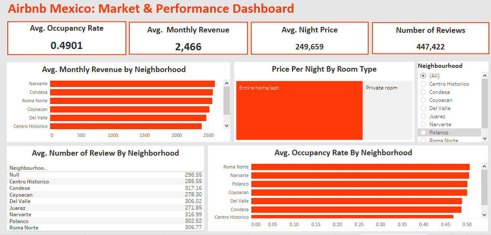

# 🏡 Airbnb Investment Opportunity Analysis (Mexico)
Python | SQL | Tableau

This project demonstrates my ability as a Data Analyst to evaluate real-world investment opportunities using large-scale marketplace data.

## Overview

This project demonstrates my ability as a Data Analyst to evaluate real-world investment opportunities using large-scale marketplace data.

Using official Airbnb datasets, I analyzed demand, occupancy, pricing strength, competition, and revenue potential across neighborhoods in Mexico to identify the most attractive areas for new Airbnb investments.

The analysis combines Python for data preparation, SQL for KPI computation, and Tableau for executive-level visualization, resulting in clear, actionable insights for investors and hosts.

## 🎯 Business Objective
Airbnb investors and hosts need to answer critical questions such as:
- Which neighborhoods show the strongest booking demand?
- Where do listings achieve high occupancy and pricing power?
- Which areas offer strong returns with manageable competition?
- Where should new listings be launched to maximize ROI?

This project addresses these questions using data-driven analysis rather than assumptions. 

## 🧠 My Role
As the Data Analyst on this project, I:
- Validated, cleaned, and transformed multi-table Airbnb datasets
- Designed demand and occupancy metrics using Python and SQL
- Built neighborhood-level KPIs for pricing, revenue, and competition
- Developed an interactive Tableau dashboard to communicate insights
- Translated technical results into investment-focused recommendations

## 🛠️ Tools & Skills Demonstrated
- Python (Pandas): Data validation, cleaning, feature engineering
- SQL: Joins, aggregations, KPI calculations, date handling
- Tableau: Interactive dashboards, storytelling, investment insights
- Business Analysis: ROI modeling, demand vs competition evaluation

## Python Tool
**Data Preparation & Cleaning**
- Loaded and validated all datasets using Pandas
- Verified data completeness, record counts, and data types
- Converted incorrect date fields to proper datetime formats
- Transformed availability indicators into numeric values:
- 1 = booked
- 0 = available

- Prepared clean, analysis-ready datasets for SQL and Tableau

Outcome: Reliable data foundation for occupancy and revenue analysis.

1️⃣ Demand Analysis

- Used review volume as a proxy for booking demand
- Aggregated reviews by neighborhood

Insight:
📍 Roma Norte shows the highest demand, driven by significantly higher guest review activity.

2️⃣ Occupancy & Pricing Performance 
- Analyzed average occupancy rate, nightly price, and estimated monthly revenue
- Compared performance across neighborhoods
- Top performers:Polanco, Roma Norte, Condesa

These areas combine strong occupancy with premium pricing, resulting in higher monthly revenue.

3️⃣ Demand vs Competition

- Measured competition using number of listings per neighborhood
- Compared against demand using reviews per listing

Insight:
- Polanco, Roma Norte, and Condesa show high demand relative to competition
- Narvarte and Juárez face higher competitive pressure with weaker demand ratios

4️⃣ Investment Opportunity (ROI Analysis)

- Built a composite ROI score using:
- Estimated monthly revenue
- Occupancy rate
- Pricing balance

Best investment opportunities:
- 🏆 Roma Norte, Narvarte, and Coyoacán

These neighborhoods deliver strong ROI with stable demand and manageable competition.

_You can access the Python file_ [here](https://github.com/ErickHdez616/-Airbnb-Investment-Opportunity-Analysis-Mexico-/blob/main/Airbnb_Investment_Python.ipynb)

## SQL Analysis

Using SQL, I computed neighborhood-level KPIs including:
- Average occupancy rate
- Average nightly price
- Estimated monthly revenue
- Number of active listings (competition)
- Total reviews (demand indicator)

SQL joins were used to connect listings, calendar, and reviews tables for deeper insights.

Key finding:
- 📈 Roma Norte recorded the highest average occupancy rate, confirming sustained demand.

_You can access the SQL Queries_ [here](https://github.com/ErickHdez616/-Airbnb-Investment-Opportunity-Analysis-Mexico-/blob/main/Airbnb_SQL_Analysis.sql)

## 📊 Tableau Dashboard

Tableau was used to validate and communicate findings visually.

**Dashboard Highlights**
- Market-wide average occupancy of 49%
- 328,600 total reviews indicating strong guest activity
- Neighborhood-level comparison of:
- Demand
- Revenue
- Occupancy
- Pricing
- Clear distinction between entire homes vs private rooms, with entire homes commanding higher prices

## Key Insights
- Airbnb performance varies significantly by neighborhood
- Roma Norte consistently leads in demand, occupancy, and ROI
- Narvarte presents strong revenue potential despite lower visibility
- Entire homes/apartments outperform private rooms in pricing and revenue

_You can access and interact with the Tableau dashboard_ [here](https://github.com/ErickHdez616/-Airbnb-Investment-Opportunity-Analysis-Mexico-/blob/main/Airbnb_Tableau_Dashboard.twb)

## 💡 Recommendations
- Prioritize Roma Norte, Narvarte, and Polanco for new Airbnb investments
- Focus on entire home/apartment listings to maximize returns
- Use demand-to-competition ratios to avoid oversaturated neighborhoods
- Apply pricing strategies aligned with high-performing areas

## 🎯 Business Impact

This analysis enables investors and hosts to:
- Reduce investment risk using data-backed location selection
- Maximize revenue through informed pricing and listing strategies
- Identify underexploited neighborhoods with strong ROI potential

*By implementing these recommendations, the organization can optimize revenue, enhance customer satisfaction, and improve workforce efficiency, ensuring sustained growth and profitability.* 🙂

## 📂 Folder Structure
- _pic.png #Screenshot of the Tableau Dashboard
- Airbnb_Investment_Python.ipynb #Python_file
- Airbnb_SQL_Analysis.sql #SQL file
- README.md #Project documentation
